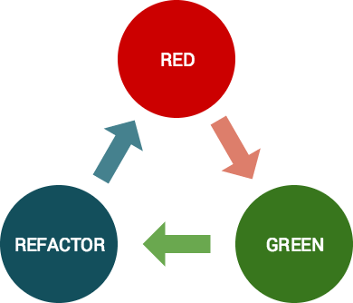

# 테스트 주도 개발(Test-Driven Development, TDD)이란

테스트 주도 개발(Test-Driven Development, TDD)이란 소프트웨어 개발 방법론으로,
먼저 테스트를 작성하고 그 테스트를 통과할 수 있는 최소한의 코드를 작성하는 방식을 의미한다. 

초기에는 **Test First Development (테스트 우선 개발)**이라고 불렸다. 
그러나 "First(우선)"라는 단어는 "Last(마지막)"라는 명확한 반의어가 있어서, 테스트를 나중에 작성하는 일반적인 개발 방식과 혼동될 수 있었다. 

또한, 많은 프로그래머가 코드를 먼저 작성한 후 테스트를 작성하는 경우가 많았기 때문에, 
더 명확한 개념을 전달하기 위해 **Test-Driven Development (TDD, 테스트 주도 개발)**라는 용어가 사용되게 되었다.

[위키](https://ko.wikipedia.org/wiki/%ED%85%8C%EC%8A%A4%ED%8A%B8_%EC%A3%BC%EB%8F%84_%EA%B0%9C%EB%B0%9C)에서는 TDD를 아래와 같이 설명하고 있다.

> 테스트 주도 개발(Test-driven development TDD)은 매우 짧은 개발 사이클을 반복하는 소프트웨어 개발 프로세스 중 하나이다. 개발자는 먼저 요구사항을 검증하는 자동화된 테스트 케이스를 작성한다. 그런 후에, 그 테스트 케이스를 통과하기 위한 최소한의 코드를 생성한다. 마지막으로 작성한 코드를 표준에 맞도록 리팩토링한다. 이 기법을 개발했거나 '재발견' 한 것으로 인정되는 Kent Beck은 2003년에 TDD가 단순한 설계를 장려하고 자신감을 불어넣어준다고 말하였다.

이 방법은 코드의 품질을 높이고, 버그를 줄이며, 유지보수를 쉽게 하기 위해 고안되었다.

## TDD의 절차
TDD는 크게 Red-Green-Blue로 불리는 세 가지 단계를 반복하는 방식으로 진행된다.

### Red (테스트 작성 및 실패 확인):

먼저, 새로 구현할 기능이나 요구사항을 반영한 테스트를 작성한다.
이 단계에서는 기능이 아직 구현되지 않았기 때문에, 테스트가 실패해야 정상이다. 테스트가 실패함으로써 테스트 코드가 제대로 동작하는지를 확인할 수 있다.

### Green (기능 구현 및 테스트 통과):

테스트를 통과할 수 있도록 최소한의 코드를 작성한다.
이 단계에서는 테스트가 성공적으로 통과되도록 하는 것이 목표다. 테스트가 통과하면 다음 단계로 넘어간다.

### Blue (리팩토링):

코드의 기능을 유지하면서 코드의 중복을 제거하거나 가독성을 높이는 리팩토링을 진행한다.
리팩토링을 마친 후에도 테스트가 통과해야 한다. 만약 테스트가 통과하지 않는다면, 리팩토링 과정에서 문제가 생긴 것이다.
이 과정을 반복하면서 점진적으로 소프트웨어를 완성해 나가는 것이다.

중요한 것은 실패하는 테스트 코드를 작성하기 전까지 실제 코드를 작성하지 않으며, 실패한 테스트를 통과할 최소한의 코드만 작성하는 것이다. 
이를 통해 실제 코드의 기대사항을 명확히 정의할 수 있어 불필요한 설계를 피하고, 정확한 요구 사항에 집중할 수 있다.

## 일반 개발 방식과의 차이점

일반적인 개발 방식에서는 보통 기능을 먼저 구현하고 나중에 테스트를 작성한다.  
반면 TDD는 기능을 구현하기 전에 테스트를 먼저 작성한다는 점에서 큰 차이가 있다.

보통의 개발 방식은 '요구사항 분석 -> 설계 -> 개발 -> 테스트 -> 배포'의 형태로 진행되며, 대표적인 모델로 **폭포수 모델**이 있다.
하지만 이러한 일련의 과정은 소프트웨어 개발을 느리게 할 수 있는 잠재적 위험이 있다.

그 이유는 다음과 같다:
* 소비자의 요구사항이 처음부터 명확하지 않을 수 있다
* 처음부터 완벽한 설계는 어렵다
* 자체 버그 검출 능력 및 코드 품질 저하
* 테스트 비용 증가
* 높은 러닝커브

  <!-- 추가 설명 -->

### TDD의 효과

TDD를 통해 얻을 수 있는 주요 장점은 다음과 같다:

* 버그 감소: 테스트를 먼저 작성하므로, 코드 작성 중에 발생할 수 있는 오류를 미리 방지할 수 있다.  이는 유닛 테스트를 하는 이점이다.
* 코드 품질 향상: 테스트를 통과하기 위해 최소한의 코드만 작성하게 되므로, 불필요한 코드가 줄어들고 코드의 가독성이 높아진다.
* 리팩토링 용이성: 이미 작성된 테스트가 있으므로, 리팩토링을 하더라도 기존 기능이 정상적으로 동작하는지 쉽게 확인할 수 있다.

이로 인해 TDD는 작은 단위부터 점진적으로 개발하며, 코드의 품질 향상으로 이어진다.

**단점**은 아래와 같다:

* 생산성 저하: 러닝 커브가 존재하기에, 퀄리티보다 빠른 결과물을 원하는 환경일 경우엔 도입이 어렵다.

<!-- 

테스트 유형

정적 테스트
단위 테스트
통합 테스트
E2E 테스트
- E2E (End-to-End) 테스트는 애플리케이션의 전체 흐름을 실제 사용자처럼 테스트하는 방식이다. 단위 테스트나 통합 테스트와 달리, 시스템의 모든 구성 요소(프론트엔드, 백엔드, 데이터베이스 등)를 포함하여 테스트한다. 실제 사용자가 수행할 수 있는 시나리오를 자동화 도구(Cypress, Selenium 등)로 실행해 기능의 올바른 동작을 확인한다. 이를 통해 다양한 환경에서 발생할 수 있는 문제를 조기에 발견할 수 있다. 그러나 설정이 복잡하고 실행 시간이 오래 걸릴 수 있다는 단점도 있다.

트레이드 오프 (Trade Off)

-->

### 주요 라이브러리
프론트엔드 개발에서 TDD를 적용하기 위해 사용되는 주요 라이브러리는 다음과 같다:

* Jest: 페이스북에서 개발한 JavaScript 테스트 프레임워크로, 빠르고 직관적인 테스트 환경을 제공한다. 단순함, 성능, 개방성과 커뮤니티와 같은 설계 목적으로 개발하였다.
* Cypress: E2E 테스트에 특화된 JS 라이브러리로, 실제 애플리케이션과 테스트 코드를 동일한 브라우저에서 실행하는 방식을 취하고 있다. 브라우저 기반의 GUI를 사용하여 테스트의 실행 상태를 확인하고 디버깅할 수 있는 다양한 편의 기능을 제공한다.
* Mocha: 테스트 러너를 포함한 테스트 프레임워크다.
초기에 NodeJs로 실행되는 애플리케이션의 테스트를 위해서 설계되었다. Assertion을 포함하지 않으므로
작동하기 위해서 다른 라이브러리 설치 및 설정 작업이 필요하다. 단위 테스트, 통합 테스트 E2E 테스트 등 다양한 테스트를 지원한다.
<!--
* React Testing Library: 애플리케이션이 어떻게 작동하는지 초점을 둔, 사용자 관점
-->
> Assertion은 에러가 없는 프로그램을 작성하기 위한 하나의 수법을 의미한다.

<!-- React testing -->

<!-- 

테스트 작성 순서: 일반 개발 방식에서는 코드 구현 후 테스트를 작성하는 반면, TDD에서는 테스트를 먼저 작성한 후 코드를 구현한다.
개발 접근 방식: 일반 개발 방식은 전체 시스템을 염두에 두고 코드를 작성하는 경우가 많지만, TDD는 작은 단위부터 시작하여 점진적으로 개발한다.

사례
TDD는 많은 유명 기업들이 채택하고 있는 방법론이다. 예를 들어, 구글, 마이크로소프트, 아마존과 같은 대형 IT 기업에서는 TDD를 통해 안정적이고 확장 가능한 소프트웨어를 개발하고 있다. 특히 스타트업에서도 빠르게 변하는 요구사항에 대응하기 위해 TDD를 적용하여 개발 속도를 높이고 있다.

Mocha: 유연하고 확장 가능한 테스트 프레임워크로, 다양한 플러그인을 통해 테스트 환경을 커스터마이징할 수 있다.
Chai: BDD 스타일의 어서션 라이브러리로, Mocha와 함께 사용하면 자연스러운 테스트 작성이 가능하다.
-->

### 테스트 유형

* 단위 테스트 (Unit Test)
  * 함수나 메서드와 같은 작은 단위의 코드를 테스트하는 데 중점을 둔다. 시스템 전체 동작에 중점을 맞추지 않는다.
* 통합 테스트 (Integration Test)
  * 두 개 이상의 단위가 함께 잘 작동하는지 확인하는 테스트.
* E2E 테스트 (End-To-End Test)
