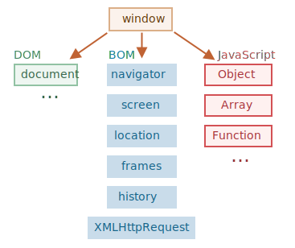

# JS 기초

JS에대한 명확한 개념과 메소드 사용법을 쉽게 참고할 수 있도록 구성한 가이드.

## 이벤트 루프란

## 브라우저 환경

JS는 웹 브라우저에서 사용하려고 만든 언어다. 이후 업데이트를 통해 다양한 사용처와 플랫폼을 지원하는 언어로 진화했다.

JS가 돌아가는 플랫폼은 호스트(host) 라고 불린다. 호스트는 브라우저, 웹서버, 심지어는 커피 머신이 될 수도 있다고 한다. 각 플랫폼은 해당 플랫폼에 특정되는 기능을 제공하는데, JS 명세서에선 이를 호스트 환경(host environment) 이라고 부른다.

호스트 환경은 플랫폼에 특정되는 객체와 함수를 제공한다. 웹 브라우저는 웹 페이지를 제어하기 위한 수단을 제공하고, Node.js는 서버 사이드 기능을 제공해준다.

아래 사진은 호스트 환경이 웹 브라우저일 때를 정리한 것이다.



최상단에 window 루트 객체가 존재한다. (하위 DOM, BOM, JS)
* JS 코드의 전역 객체이다.
* '브라우저 창(browser window)'을 대변하고, 이를 제어할 수 있는 메서드를 제공한다.

문서 객체 모델(Document Object Model, DOM)은 웹 페이지 내의 모든 콘텐츠를 객체로 나타내주며 수정 가능하다.
document 객체는 페이지의 기본 ‘진입점’ 역할을 한다. document 객체를 이용해 페이지 내 그 무엇이든 변경할 수 있고, 원하는 것을 만들 수도 있다.

브라우저 객체 모델(Browser Object Model, BOM)은 문서 이외의 모든 것을 제어하기 위해 브라우저(호스트 환경)가 제공하는 추가 객체를 나타낸다.
ex. 현재 사용 중인 브라우저 정보를 알려주는 ```navigator.userAgent```와 브라우저가 실행 중인 운영체제 정보를 알려주는 ```navigator.platform```.
ex. ```location``` 객체는 현재 URL을 읽을 수 있게 해주고 새로운 URL로 변경(redirect)할 수 있게 해준다.

```alert/confirm/prompt``` 도 BOM의 일부다. 문서와 직접 연결되어 있지 않지만, 사용자와 브라우저 사이의 소통을 도와주는 순수 브라우저 메소드다.

<!-- 호스트 환경이 웹 브라우저일 때 사용할 수 있는 기능을 알기 위해서 

-->

## 반복문
> map / forEach / for...of / for...in

* map: 배열의 각 요소를 순회하고, 그 결과로 새로운 배열을 반환한다. 주로 값을 변환하여 새로운 배열을 만들 때 사용된다.

* forEach: 배열의 각 요소를 순회하며, 반환값이 없고 새 배열을 생성하지 않는다. 요소에 대한 작업은 가능하지만, 주로 **부수 효과**를 줄 때 유용하다.
###### 부수 효과: 외부 상태나 변수에 영향을 주는 작업을 의미

* for...of: 배열, 문자열, Set, Map 등 **이터러블** 객체를 순회하며, 각 요소 값을 직접 사용할 수 있다. 주로 배열과 이터러블 객체에서 요소를 순회할 때 적합하다.
###### 이터러블: 자료를 반복할 수 있는, Symbol.iterator가 구현된 객체를 말한다. Symbol.iterator는 객체를 반복 가능한(iterable) 객체로 만들어주는 특수한 심볼 프로퍼티이다. 간혹 'undefined' is not iterable 에러가 나는데, 이터러블 타입의 인자를 받아야 하는 메소드가 다른 타입의 값을 받았기 때문이다.

* for...in: 객체의 모든 열거 가능한 속성 키를 순회한다. 주로 객체의 속성 키에 접근할 때 사용된다.
###### 배열에는 비추천 (인덱스와 순서가 달라질 수 있음)


## Promise

Promise 객체는 비동기 작업의 완료나 실패를 나타내는 독자적인 객체다 (ex. Array, Object). 비동기 작업이 끝날 때까지 결과를 기다리는 것이 아닌, 결과를 제공하겠다는 '약속'을 반환한다는 의미로 Promise라 불리게 되었다.

Promise는 함수로 감싸 사용하는 것이 일반적이다.

```javascript
function promiseFunction() {
  return new Promise((resolve, reject) => {
    if () {
      resolve();
    } else {
      reject();
    }
  });
}
```

위처럼 프로미스 객체를 반환하는 함수를 생성하고 호출하면 프로미스 생성자를 반환한다. (생성된 프로미스 객체를 함수 반환값으로 사용하는 기법). 이처럼 프로미스 객체를 함수로 만드는 이유는 3가지가 있다.

* 재사용성 : 필요할 때마다 호출하여, 반복되는 비동기 작업을 효율적으로 처리할 수 있다.
* 가독성 : 코드의 구조가 명확해져, 비동기 작업의 정의와 사용을 분리해 코드의 가독성을 높일 수 있다.
* 확장성 : 인자를 전달하여 동적으로 비동기 작업을 수행할 수 있다. 또한 여러 개의 프로미스 객체를 반환하는 함수들을 연결하여 복잡한 비동기 로직을 구현할 수 있다.

### async

function 앞에 ```async```를 붙이면 해당 함수는 항상 Promise 객체를 반환한다. 이 특징 덕분에, async 함수 내에서 반환하는 값이 프로미스가 아니어도 자동으로 Promise.resolve()로 감싸져 반환된다.

예를 들어, 아래와 같은 상황이 있다.

#### 일반 함수의 반환

```javascript
function normalFunction() {
  return 42;
}

console.log(normalFunction()); // 42
```

#### async 함수의 반환
```javascript
async function asyncFunction1() {
  return 42;
}

console.log(asyncFunction()); // Promise { 42 }

async function asyncFunction2() {
  return Promise.resolve(42);
}

```

위의 두 함수 모두 Promise를 반환하는데, 첫 번째 함수는 반환 값 42가 자동으로 Promise.resolve(42)로 감싸져 반환되는 것이다.

이런 특징은 async/await 패턴에서 값을 처리할 때 일관성을 유지할 수 있게 해 주는 중요한 동작이다.

### await

```await``` 은 async 함수 안에서만 동작한다.

JS는 await 키워드를 만나면 Promise가 처리될 때까지 기다린다. 결과는 그 이후 반환된다.

예를 들어, 1초 후 이행되는 Promise 코드를 통해 await가 어떻게 동작하는지 살펴보자.

```javascript
async function asyncFunction() {

  let promise = new Promise((resolve, reject) => {
    setTimeout(() => resolve("완료"), 1000)
  });

  let result = await promise; // promise가 처리될 때까지 기다림

  alert(result); // "완료"
}

asyncFunction();
```

함수를 호출하고, 함수 본문이 실행되는 도중 await 줄에서 실행이 잠시 **중단**되었다가 Promise가 처리되면 재개한다.
이때 Promise 객체의 결과값이 변수 result에 할당된다. 따라서 위 예시를 실행하면 1초 뒤 **완료**가 출력된다.

<!-- 비동기 -->
Promise가 처리되길 기다리는 동안엔 엔진이 다른 일(다른 스크립트 실행, 이벤트 처리 등)을 할 수 있기 때문에, CPU 리소스가 낭비되지 않는다.

또한 promise.then보다 가독성 좋고, 사용하기 쉬워 Promise의 result 값을 얻는데 유용하다.

