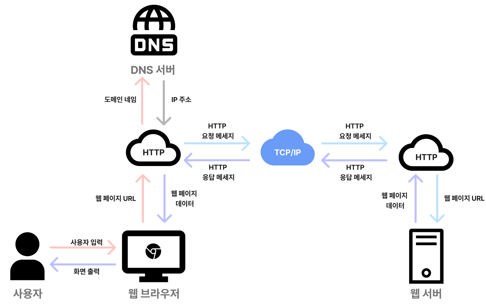
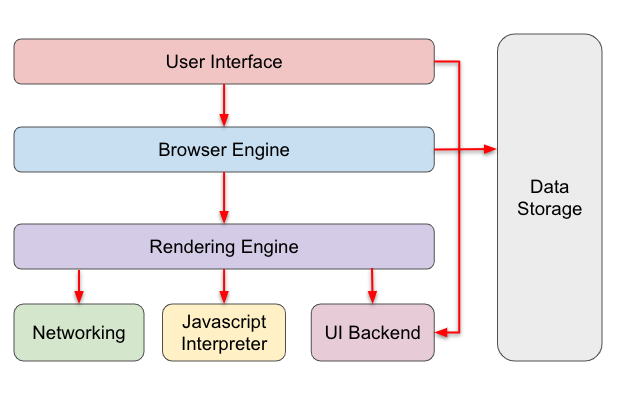

# 브라우저란 무엇인가?

브라우저는 사용자가 입력한 URL을 통해 웹 서버에 요청을 보내고, 서버로부터 받은 데이터를 해석하여 화면에 출력하는 소프트웨어다. 웹 페이지 탐색, 애플리케이션 실행, 미디어 콘텐츠 재생 등 다양한 작업을 수행할 수 있도록 돕는다.

<!-- 브라우저는 페이지를 다운로드하기 위해 응용 계층의 HTTP 프로토콜을 이용해 데이터를 송신/수신한다. -->

- - -

## 브라우저의 서버 요청 플로우

브라우저에서 URL을 입력했을 때, 다음과 같은 흐름으로 동작한다.

<!-- 이미지 -->

### URL 파싱:

사용자가 입력한 URL을 분석하여 스키마(프로토콜), 도메인, 경로 등을 구분한다.  
이 과정에서 HTTP 또는 HTTPS 등 프로토콜의 종류를 확인한다.

<!-- 구분 예시 -->

### HTTP 확인:

URL의 스키마를 통해 요청에 사용할 프로토콜을 확인한다.

<!--
[HSTS 목록 조회]

HTTP 대신 HTTPS만을 사용하여 통신해야한다고 웹사이트가 브라우저에 알리는 보안 기능.
만약 HTTP로 요청이 왔다면 HTTP 응답 헤더에 "Strict Transport Security"라는 필드를 포함하여 응답.
이를 확인한 브라우저는 해당 서버에 요청할 때 HTTPS만을 통해 통신하게 된다.
-->

<!-- 예를 들어, https라면 보안 연결(암호화)을 위한 추가적인 TLS 핸드셰이킹 과정이 필요하다. -->

<!-- 암호화 관련 -->

### URL을 IP로 변환 (DNS):

브라우저는 DNS 서버에 요청을 보내 URL의 도메인 이름을 숫자로 된 IP 주소로 변환한다.
IP 주소는 컴퓨터가 통신하기 위해 사용하는 실제 주소이다.

<!-- 반환되는 값 -->

### 라우터를 통해 서버 게이트웨이로 이동:

IP 주소를 기반으로 인터넷을 통해 요청이 올바른 서버로 전달된다.
네트워크 라우터가 데이터를 중계하며, 요청은 서버의 게이트웨이에 도착한다.

### IP 주소를 MAC 주소로 변환:

네트워크 내에서 통신하기 위해 ARP(Address Resolution Protocol)를 사용하여,
IP 주소를 물리적인 MAC 주소로 변환한다.

### 대상 서버와 TCP 소켓 연결:

서버와의 데이터를 주고받기 위해 TCP 소켓 연결을 설정한다.
HTTPS라면 암호화된 연결을 설정하기 위해 TLS 핸드셰이킹이 추가로 이루어진다.

<!-- 핸드셰이킹 과정 -->

### HTTP 프로토콜로 요청 및 응답 처리:

브라우저가 HTTP 요청을 보내고, 서버는 이에 대한 응답으로 HTML, CSS, JavaScript 등의 데이터를 반환한다.

### 브라우저에서 응답 해석 (렌더링 엔진):

서버로부터 받은 HTML, CSS, JavaScript 파일을 브라우저의 렌더링 엔진이 처리한다.

이 과정에서:
*    HTML: DOM(Document Object Model)으로 변환.
*    CSS: CSSOM(CSS Object Model)으로 변환.
*    JavaScript: 브라우저의 JavaScript 엔진에서 실행.

DOM과 CSSOM을 결합하여 렌더 트리를 생성하고, 이를 화면에 그려준다(레이아웃, 페인팅).

<!-- 렌더링 과정 자세히 -->

## 브라우저의 기본 구조

브라우저는 다음과 같은 주요 구성 요소로 이루어져 있다.

**1. 사용자 인터페이스 (User Interface):**
사용자가 브라우저와 상호작용하는 화면 요소를 제공한다. 주소창, 북마크, 뒤로/앞으로 가기 버튼 등이 이에 해당한다. (요청한 페이지를 보여주는 창을 제외한 나머지 부분이다.)

**2. 브라우저 엔진 (Browser Engine):**
사용자 인터페이스와 렌더링 엔진 사이에서 동작을 제어하며 (중개), 렌더링과 관련된 명령을 관리한다.

**3. 렌더링 엔진 (Rendering Engine):**
요청한 콘텐츠를 표시한다. HTML, CSS를 해석해 화면에 표시하고, DOM(Document Object Model)과 CSSOM(CSS Object Model)을 생성한다.

**4. 통신 (Networking):**
HTTP/HTTPS 요청을 처리하고 서버와의 데이터를 송수신한다.

**5. UI Backend:**
콤보 박스와 윈도우 창 같은 기본적인 UI를 그림. 플랫폼에서 명시하지 않은 기본적인 인터페이스로서, OS 사용자 인터페이스 체계를 사용.

**6. JavaScript 엔진 (JS 해석기):**
JavaScript 코드를 실행하고, 웹 애플리케이션의 동적인 기능을 처리한다.

**7. 데이터 저장소:**
쿠키, 로컬 스토리지, 세션 스토리지 등 브라우저에 데이터를 저장하는 계층이다.

<!--

접기/펼치기 버튼

|제목|내용|
|--|--|
|1|1|
|2|10|

-->
